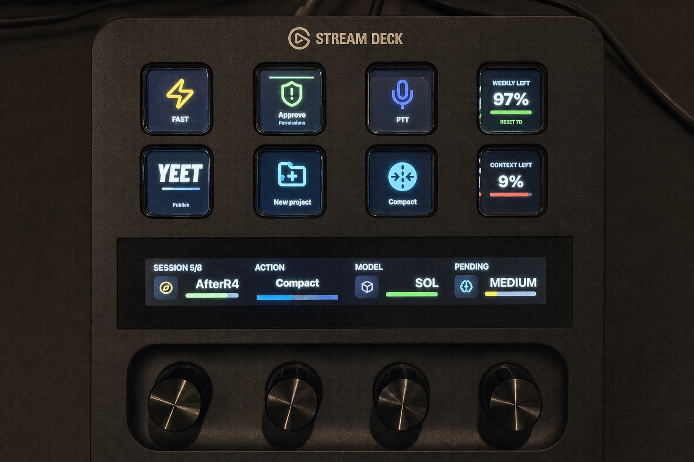

# Stream Deck Codex Companion

[](https://github.com/twidtwid/streamdeckcodex/actions/workflows/ci.yml)
[](LICENSE)

Local Stream Deck controls for the Codex desktop app on macOS. It provides live
chat status, commands, workflows, approval mode, usage, and context on keys.
Each supported Stream Deck family gets a layout sized for its physical keys.
Stream Deck + also gets four live dials.

This is an unofficial community project. It is not affiliated with or endorsed
by OpenAI, Work Louder, Elgato, or Corsair, and it includes no proprietary
OpenAI artwork or source.



> **Beta:** the Stream Deck + experience is hardware-tested. The Stream Deck,
> Mini, Neo, and XL profiles pass automated and Elgato validation; their first
> independent hardware test is still in progress.

## Install from GitHub

Requirements:

- macOS 13 or newer
- [Codex desktop](https://openai.com/codex/) installed and signed in
- Stream Deck 7.1 or newer
- Stream Deck, Stream Deck Mini, Stream Deck Neo, Stream Deck XL, or Stream
  Deck +; dials require Stream Deck +

1. Open the repository's
   [Releases](https://github.com/twidtwid/streamdeckcodex/releases) page.
2. Download `com.todd.streamdeckcodex.streamDeckPlugin` from the newest release.
3. Double-click the downloaded file and approve installation in Stream Deck.
4. Open Codex and select a chat.
5. In **System Settings → Privacy & Security → Accessibility**, grant
   access to **Elgato Stream Deck** and, when listed, its
   **trampoline_handler** helper. Stream Deck 7.5 launches plugin processes
   through that helper, so macOS may require both entries.

No API key, account token, background service, or separate Codex CLI
installation is required.

### Included profiles

The editable profile for the connected model should install automatically.
Every layout starts with Live Controls, followed by Agents & Sessions, then the
workflow pages. Mini splits sections across additional pages to fit its six
keys without dropping actions.

If no profile appears, download and open the matching release asset:

| Hardware         | Manual profile asset                            |
| ---------------- | ----------------------------------------------- |
| Stream Deck      | `streamdeckcodex-stream-deck.streamDeckProfile` |
| Stream Deck Mini | `streamdeckcodex-mini.streamDeckProfile`        |
| Stream Deck Neo  | `streamdeckcodex-neo.streamDeckProfile`         |
| Stream Deck XL   | `streamdeckcodex-xl.streamDeckProfile`          |
| Stream Deck +    | `streamdeckcodex-plus.streamDeckProfile`        |

The first page contains FAST, Permissions, PTT, Quota, YEET, New Project,
Compact, and Context. Agents & Sessions contains six live chat slots, New Chat,
and Plan. The remaining sections are Git & Delivery, Code Quality, Decisions,
Workspace, and Codex Panels.

Reinstalling a profile creates another copy instead of overwriting personal
changes. Remove an older test copy in Stream Deck's Profiles settings if you no
longer need it.

All 50 key actions are present on every button-only profile. Model, Reasoning
Effort, and Agent Navigator are dial-only; the key experience does not depend
on them. Hold PTT while speaking and release the key to stop.

Please include the exact Stream Deck model, macOS version, Stream Deck version,
Codex version, and the failing action when
[reporting a beta issue](https://github.com/twidtwid/streamdeckcodex/issues/new?template=bug_report.yml).

## What it does

- Shows six recent Codex chats with live idle, running, unread, needs-input,
  error, and focused states.
- Opens the exact chat represented by a key or dial.
- Toggles FAST and Plan only after verifying the visible Codex result.
- Cycles the focused chat's real permission choices: Ask, Approve, YOLO, and
  Custom. Entering YOLO handles Codex's Full Access confirmation and verifies
  the result.
- Provides guarded push-to-talk, New Chat, New Project, Compact, Review,
  Browser, Files, Side chat, Settings, and other Codex commands.
- Launches named PR review, debugging, refactoring, testing, Git, and code
  workflows in the focused workspace.
- Displays weekly quota, banked resets, and focused-chat context from local
  Codex data.
- On Stream Deck +, previews and applies Model and Reasoning selections with
  live dial feedback. Available models and reasoning levels come from the
  signed-in Codex model catalog; Ultra appears only when the selected model
  advertises it.
- Provides an optional read-only Companion Health action and `npm run doctor`
  report without adding another key to the bundled profiles.

### Live status colors

| State                       | Color     |
| --------------------------- | --------- |
| Idle                        | `#FFFFFF` |
| Unread completion           | `#9BF396` |
| Thinking or running         | `#9CD5FE` |
| Approval or answer required | `#FFD0B8` |
| Error                       | `#FF7373` |
| Empty slot                  | Off       |

### Stream Deck + dials

| Dial      | Turn                                      | Press                          |
| --------- | ----------------------------------------- | ------------------------------ |
| Agent     | Browse recent chats                       | Open selected chat             |
| Action    | Select a curated Codex action             | Run the displayed action       |
| Model     | Preview available Luna/Terra/Sol families | Apply once to the focused chat |
| Reasoning | Preview a level supported by that model   | Apply once to the focused chat |

Touch-strip taps and holds are intentionally inert so a page swipe cannot run a
command accidentally.

## macOS Accessibility

Commands that operate Codex's visible UI need Accessibility permission for the
Stream Deck App and, on Stream Deck versions that use it to launch plugins, the
listed `trampoline_handler` helper. The native helper has a fixed allow-list;
it cannot execute an arbitrary shell command.

Plan, FAST, Model, Reasoning, and Permissions reread the visible Codex control
before reporting success. If Codex changes focus, contains a draft where that
would be unsafe, or does not expose the expected control, the action fails
closed and displays an alert.

Current Codex builds may expose the empty composer hint as its accessibility
value and keep Model/Reasoning under the picker's advanced options. The
companion recognizes the exact empty hints, preserves all other draft text,
opens the advanced controls when needed, and verifies the visible picker after
each apply.

Push-to-talk uses the focused composer's native **Dictate** accessibility
control and does not hold a keyboard shortcut. The watchdog verifies that
**Stop dictation** appears before reporting a successful start. Releasing the
key, leaving the page, stopping the plugin, losing the parent process, a failed
start, or the 60-second maximum hold invokes the native stop path. A bounded
legacy key-up cleanup remains only to recover from older installed builds that
may have left a modifier pressed.

## Privacy and security

The plugin runs locally and:

- opens Codex's local SQLite index read-only with `PRAGMA query_only`;
- reads bounded tails of recent Codex rollout and desktop-log files;
- uses the Codex App's bundled local app-server for account limits and model
  metadata;
- uses documented `codex://` links and user-authorized macOS UI automation;
- never writes Codex's SQLite database, rollouts, config, or App files;
- has no analytics, telemetry, independent network service, credential prompt,
  or direct credential access.

The plugin package is immutable at runtime and does not read its own manifest,
which keeps it compatible with Elgato Marketplace DRM packaging.

See [SECURITY.md](SECURITY.md) for private vulnerability reporting.

## Troubleshooting

### A key displays an alert or does nothing

1. Confirm Codex is open with a chat selected.
2. Confirm Stream Deck is enabled under macOS Accessibility.
3. Clear any unsent draft before using Plan or FAST.
4. Press the key again while the intended Codex window is visible.

The plugin refuses ambiguous focus instead of sending input to another chat.

### Permissions shows a failure reason

Open the intended Codex chat and keep its composer frontmost, then press
Permissions again. The key reads the visible composer; it does not guess from
saved configuration or another chat. It now shows a compact cause such as
`No Chat`, `Background`, `Access`, `Timeout`, `Wrong Chat`, or `No Data` instead
of the ambiguous `Unknown`. The read-only doctor reports the same stable reason
codes in full.

### No profile appeared

Open the matching `.streamDeckProfile` release asset from the table above. If
the model-specific profile still does not appear, confirm the Stream Deck App
recognizes the device, then include its exact model in a beta bug report.

### Usage or Context shows no data

Usage needs a working signed-in Codex App session. Context needs a recent token
snapshot from the focused chat. Both display no data rather than borrowing a
value from another chat. Run:

```sh
npm run doctor
```

The report gives a compact reason such as `no-focus`, `codex-background`,
`stale`, or `unsupported-schema`. It is local and omits task IDs, titles,
prompts, transcripts, URLs, and full paths by default.

### Reporting a bug

Use the [bug report
template](https://github.com/twidtwid/streamdeckcodex/issues/new?template=bug_report.yml).
Do not attach Codex transcripts, rollout files, credentials, or private paths.
Include the plugin build SHA printed by `npm run doctor -- --json`.

## Known limitations

- Codex does not publish a stable desktop command API for every action, so some
  controls depend on documented shortcuts and visible accessibility labels.
- A Codex UI or local-schema update can require a companion update; failures
  are explicit and never shown as successful.
- Accept and Reject act on the currently visible approval or question. Read the
  request in Codex before accepting it.
- Unread acknowledgement is companion-local and resets when the plugin process
  is replaced.
- Stream Deck preserves customized profiles during plugin upgrades; profiles
  do not auto-update in place.

## Build from source

Development requires Node.js 24, librsvg, and ImageMagick.

```sh
git clone https://github.com/twidtwid/streamdeckcodex.git
cd streamdeckcodex
npm ci
npm run check
npm run link
```

Useful commands:

```sh
npm run check       # formatting, types, tests, visual QA, build, validation
npm run pack        # create dist/com.todd.streamdeckcodex.streamDeckPlugin
npm run qa:design   # render and evaluate every profile key
npm run doctor      # read-only installed/runtime health and build identity
```

See [ARCHITECTURE.md](ARCHITECTURE.md) for the runtime boundaries, source
layout, polling model, and safety invariants.

The connected mutation gate is intentionally separate from CI and fails closed
unless it can prove a disposable fixture, exact foreground chat, empty
composer, and cleanup. See [QA.md](QA.md) before running connected QA.

## Release checklist

```sh
npm ci
npm run release:verify
```

`release:verify` runs full and production dependency audits, generated-source
parity, type/unit/native/visual checks, the official Elgato validator, package
creation, documentation checks, and a read-only doctor report. Connected
mutations remain separate and must be run explicitly with
`npm run release:verify:connected` only after the visible composer is empty.

The release should contain:

- `com.todd.streamdeckcodex.streamDeckPlugin`
- `streamdeckcodex-stream-deck.streamDeckProfile`
- `streamdeckcodex-mini.streamDeckProfile`
- `streamdeckcodex-neo.streamDeckProfile`
- `streamdeckcodex-xl.streamDeckProfile`
- `streamdeckcodex-plus.streamDeckProfile`
- release notes naming supported macOS, Stream Deck, and Codex versions

The package includes this project's MIT license and complete license texts for
bundled runtime dependencies. Elgato's CLI validates the manifest and package
before creating the installer.

## Attribution

Every redistributable pictogram is generated from
[Lucide](https://lucide.dev/). YEET is an original outlined wordmark generated
from the open-licensed Barlow Condensed Black Italic font. No installed
ChatGPT/Codex or Codex Micro artwork is embedded.

Implementation research included the official
[Stream Deck SDK](https://docs.elgato.com/streamdeck/sdk/),
[Marketplace plugin guidelines](https://docs.elgato.com/guidelines/stream-deck/plugins/),
and public open-source Stream Deck integrations listed in
[THIRD_PARTY_NOTICES.md](THIRD_PARTY_NOTICES.md).

The current requirement-by-requirement release audit is in
[MARKETPLACE.md](MARKETPLACE.md).

Contributions are welcome. Read [CONTRIBUTING.md](CONTRIBUTING.md) and the
[Code of Conduct](CODE_OF_CONDUCT.md) first.
